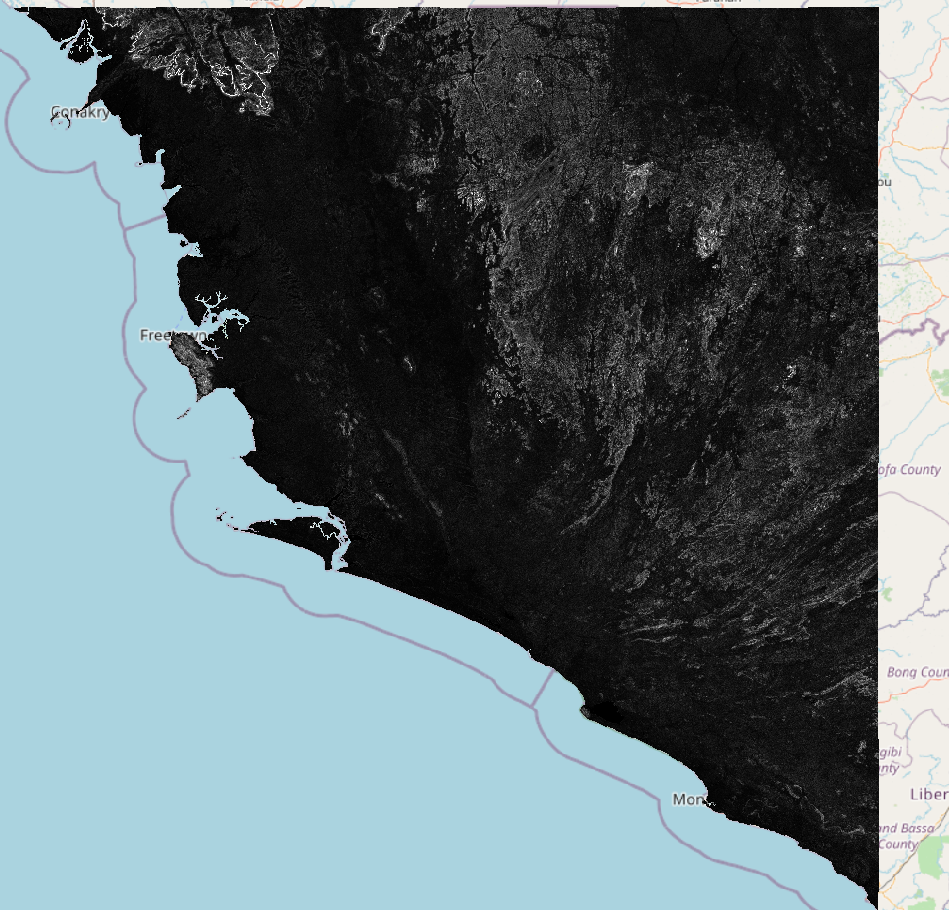

## GDAL Terrain Roughness Index

A small reproduction of the bug where the default algorithm for TRI in GDAL 3.2 was
for _underwater_ terrain, when most would expect the default to be for land-based terrain.
This was changed in GDAL 3.3. Bugs happen, this is more an example of how the same CLI command
can produce vastly different results and this may go amiss when part of a larger pipeline.

### Difference

The difference is significant. On the diff `gdalinfo` reports:

```
Min=-372.050 Max=0.000
Mean=-15.297
```

A QGIS render shows the extent. White pixels are the most changed.

